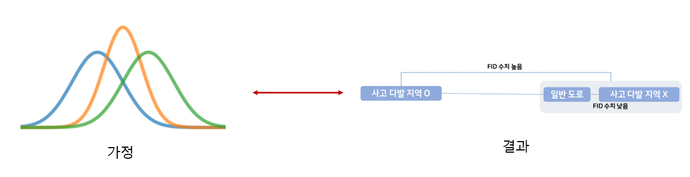
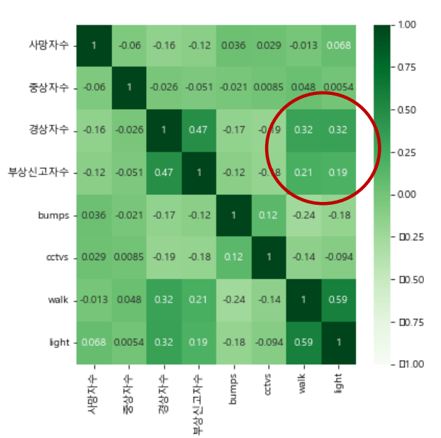
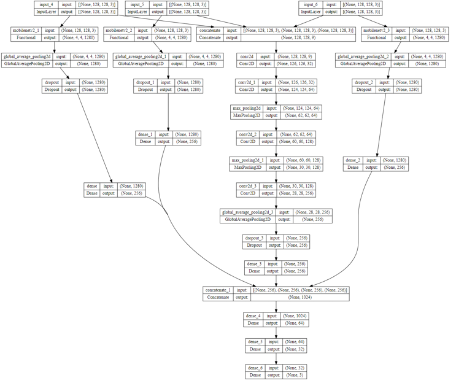
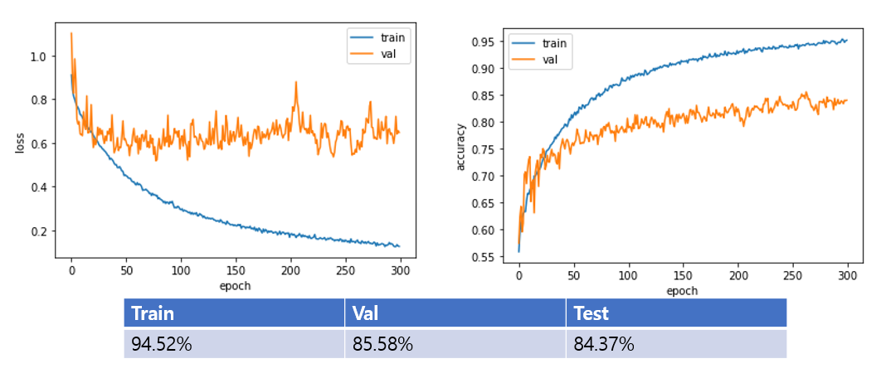
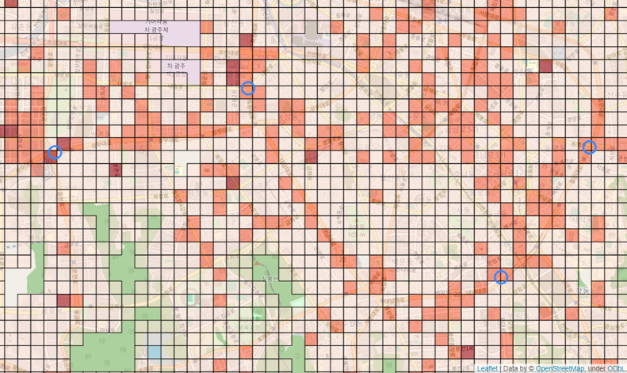

# 공간 데이터를 통한 이륜차 사고다발지 예측

- 해외와는 다르게 국내 도로 이미지 데이터를 활용한 사고다발지 예측에 관한 프로젝트를 찾을 수 없었기에 국내 사고다발지 좌표데이터를 사용하여 사고다발지를 예측해보고자함.
- 다양한 시도를 통해 해외 관련 프로젝트들과 성능차이를 내보고자함.

## 데이터 수집

### CSV 데이터

- 국내 사고다발지 좌표:
- 서울시 공간 데이터 (데이터 탐색에 활용)
  - CCTV 좌표:
  - 과속방지턱 좌표
  - 횡단보도 좌표:
  - 신호등 좌표:

### 이미지 데이터

- Folium(위성) 사용
- OSMNX(도로 네트워크) 사용
- Google Earth Engine(수치고도) 사용

## 데이터 처리

- Folium 데이터: zoom을 17로, center crop 180으로 처리
- QGIS: 수집한 공간데이터인 서울시 데이터와 사고다발지 데이터를 합침.

## 데이터 탐색(상관분석)

### 도로형태와 사고와의 상관관계

두 이미지 집합간의 특징 거리를 계산하는 FID를 사용하여 도로 형태와 사고는 상관관계가 있다고 판단함.

### 교통 시설물 공간 데이터 탐색

- 과속방지턱, CCTV는 비교적 사상자수와 상관관계가 적음
- 횡단보도, 신호등은 상관관계가 있음
- 하지만, 위성 이미지에는 횡단 보도와 신호등과 같은 정보가 포함되어 있으므로, 직접적으로 사용하지 않음.

## 모델 설계

## 모델 학습

## 결과

## 관련 프로젝트 비교
